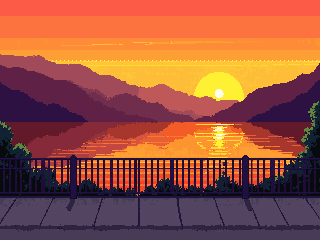

# 🚴‍♂️ Rouleur: Pixel Bike Sprint  
*A Love2D game created for the Rouleur art competition.*

## 🎨 About the Project

This game was created as a submission for the Rouleur Discord Art Competition, celebrating the return of the server and the launch of the **Rouleur Collection**.

> “Create a piece of art based on the collection. It can be anything — a painting, a movie, an object, a dance… literally anything that could be considered art.”

This interactive artwork is a **2D bike racing game** built in [Love2D](https://love2d.org/), combining pixel art, animation, and sound design to evoke the energy and motion of a grand tour cycling sprint. Every asset, from the pixel graphics to the background animation, was **hand-drawn and coded without the use of AI**.

## 🕹️ Gameplay

- Race through an abstract road course inspired by vintage cycling tours.
- Compete against AI opponents and aim for the finish line.
- Explore the in-game gallery showcasing pieces from the Rouleur collection.

## 🏁 How to Play

| Control | Action        |
|---------|----------------|
| `W`     | Accelerate     |
| `S`     | Decelerate     |
| `A`     | Steer Left     |
| `D`     | Steer Right    |
| `Mouse` | Navigate menus |
| `ESC`   | Back to menu   |

## 🛠️ Running the Game

### Option 1: With LÖVE2D (Locally)

1. [Download LÖVE](https://love2d.org/)
2. Clone this repo or download the `.love` file.
3. Run the .love file :) 

## Option 2: Play in Browser (love.js)

Coming soon — the game will be playable via WebAssembly through love.js. Hosting details will be added here once it's deployed.

Code & Animation: Inder

Engine: LÖVE 11.5

